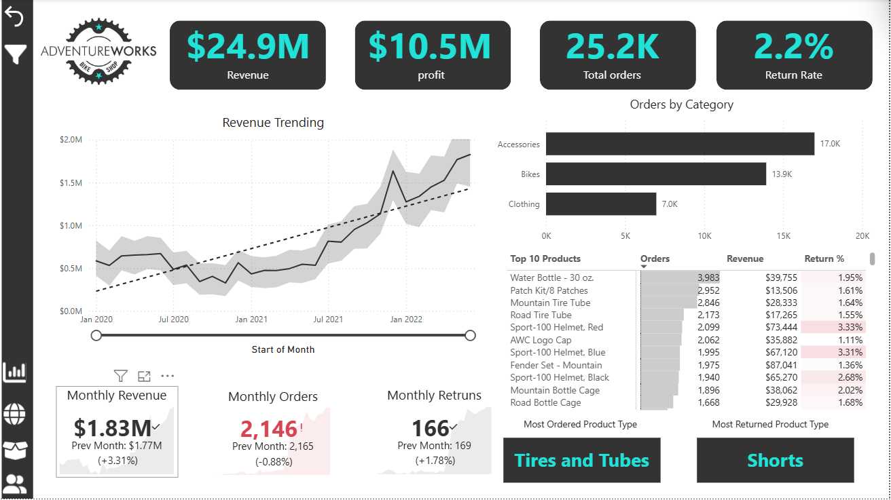
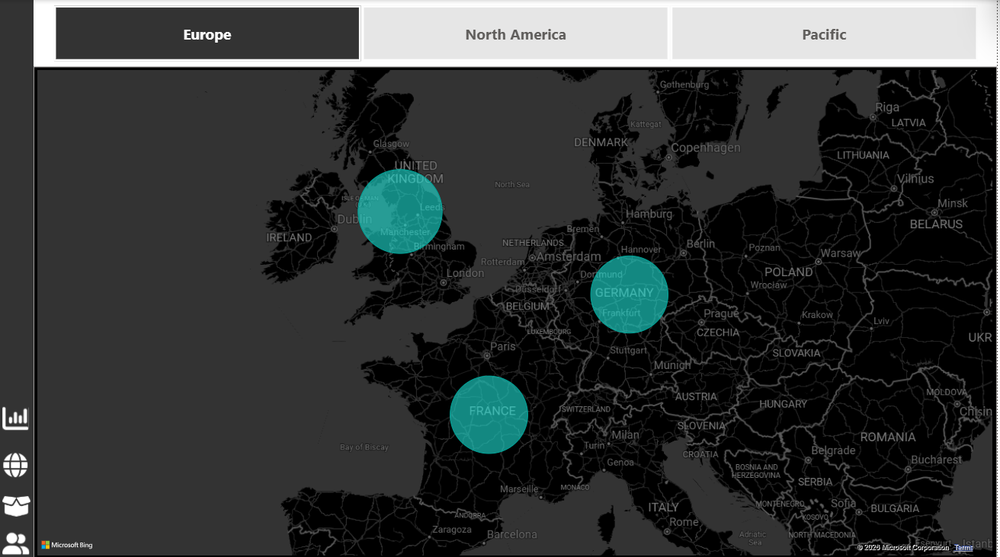
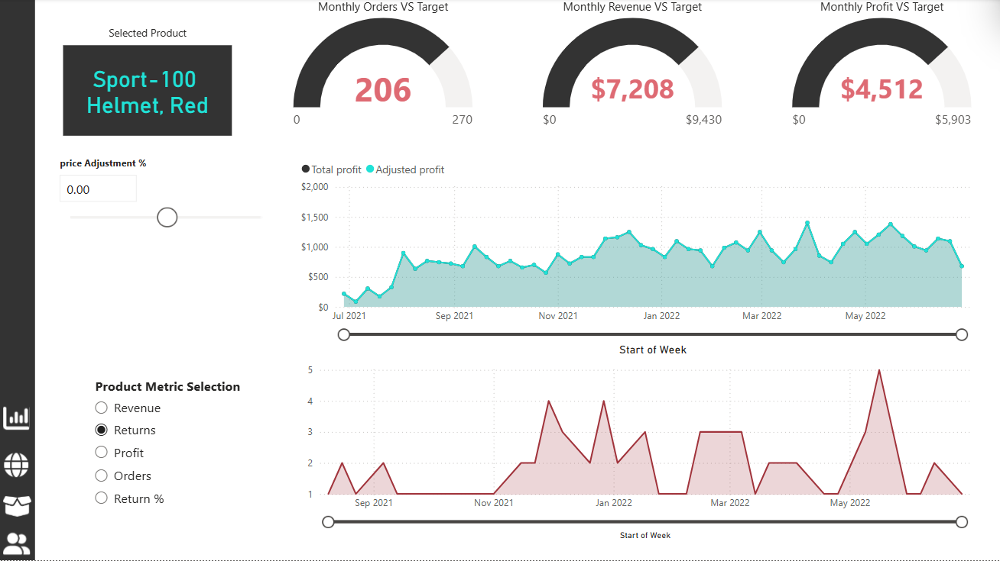
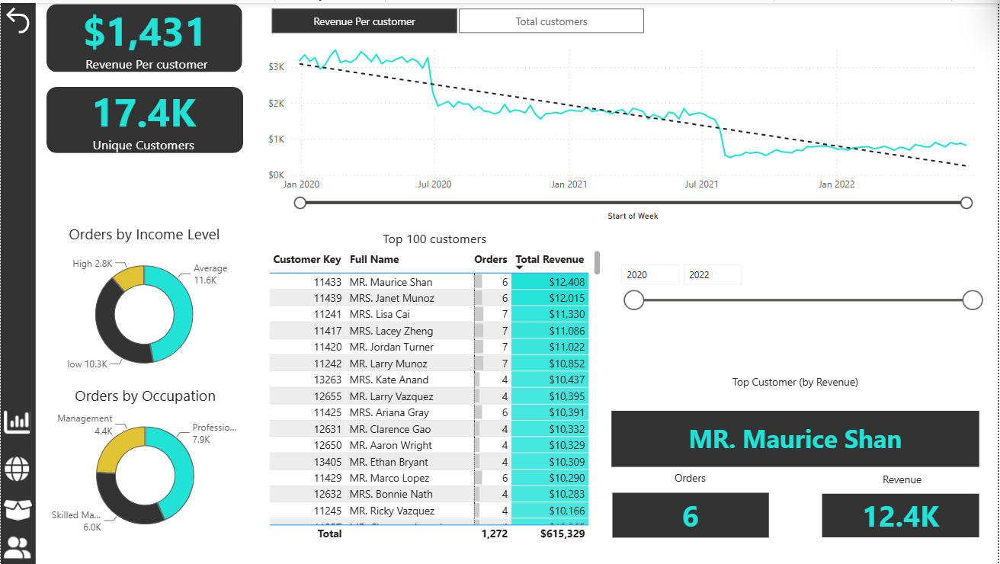

# 📊 AdventureWorks Power BI Dashboard

## 📌 Project Overview

This project presents an interactive Power BI dashboard built using the Microsoft AdventureWorks dataset. It provides business insights into sales performance, customer behavior, product performance, and regional analysis through interactive visualizations and dynamic reports.

---

## 🛠️ Tools & Technologies

- Power BI Desktop
- Power Query
- DAX
- Data Modeling

---

## 📈 Dashboard Pages

### 🏠 Dashboard
Executive overview of revenue, profit, orders, and return rate with interactive KPIs.

### 🌍 Map
Geographical analysis of sales across different regions.

### 📦 Product Detail
Detailed product performance analysis including revenue, profit, returns, and target tracking.

### 👥 Customer Detail
Customer segmentation, revenue trends, top customers, and demographic insights.

---

## 📊 Key KPIs

- Total Revenue
- Total Profit
- Total Orders
- Return Rate
- Revenue per Customer
- Unique Customers

---

## ✨ Features

- Interactive Dashboard
- Drillthrough Pages
- Dynamic Filters
- KPI Cards
- Time Intelligence
- Map Visualizations
- Customer Analytics
- Product Analytics

---

## 📷 Dashboard Preview

### Dashboard

### Map

### Product Detail

### Customer Detail

---

## 🎯 Skills Demonstrated

- Data Visualization
- Dashboard Design
- Business Intelligence
- DAX Measures
- Data Modeling
- Power Query
- Interactive Reporting

---

## 👨‍💻 Author

**Abdelrhman Hekal**
